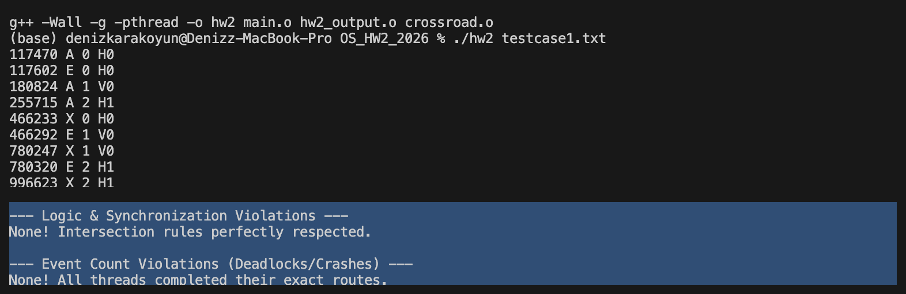

# Hw2 — Crossroad: a monitor for a shared intersection

An intersection with `H` horizontal and `V` vertical lanes. Every car is a
pthread that calls `arrive_crossroad()`, drives through, and calls
`exit_crossroad()`. Lanes carry static priorities. The controller has to make
sure that

- **no two perpendicular cars are ever inside at the same time** (mutual exclusion
  between directions),
- cars from the *same* direction can cross in parallel — one per lane,
- a higher-priority lane always goes first, and among equal priorities the car
  that arrived first goes first (so nobody starves),
- and it never deadlocks, however the OS decides to schedule the threads.

All of that lives in [`crossroad.cpp`](crossroad.cpp) — the only file I wrote.
Everything else is the course skeleton.

## Design

The whole thing is one `Controller : public Monitor`, so every public entry point
opens with `__synchronized__` and the lock discipline is impossible to get wrong.

**One condition variable per car, not per lane.** Each arriving car allocates its
own `Monitor::Condition` and parks on it. That turns wake-ups into targeted
signals instead of a thundering herd — when the intersection drains, only the
cars that can actually move get notified.

**Per-lane min-heaps keyed by arrival time.**

```cpp
using MinHeapQueue = std::priority_queue<
    std::pair<unsigned, Monitor::Condition*>,
    std::vector<std::pair<unsigned, Monitor::Condition*>>,
    std::greater<std::pair<unsigned, Monitor::Condition*>>>;
```

A monotone `global_time` counter, bumped under the monitor lock, hands each car a
ticket. The heap head of a lane is therefore always the car with the strongest
claim in that lane, which makes "is it my turn?" an O(1) peek.

**Priority buckets.** Lanes are bucketed by priority once, at construction, after
normalising the priorities to `0..max`. `is_higher_car_waiting()` then walks the
buckets from the top down and answers the ordering question without rescanning
every lane structure.

**The gate.** A car sleeps while any of these hold:

```cpp
while ((active_dir != dir && active_car > 0)   // perpendicular traffic inside
       || waiting_list[dir][lane].top().first != our_arrival_time  // not first in my lane
       || is_occupied[dir][lane]                // my lane is busy
       || is_higher_car_waiting(dir, lane, our_arrival_time))      // someone outranks me
    our_turn->wait();
```

**Handing over.** On exit, if the car was the last one inside, the controller
picks the highest-priority direction that still has waiters and notifies the head
of each of its lanes — a whole perpendicular group is released at once. If cars
are still crossing, it only wakes the next car in its own lane, and only if
nobody outranks it.

## Verification

`grader.py` (and the bigger [`tests/`](tests) set) replay the event log and check
it against the intersection rules. Clean run:



```
--- Logic & Synchronization Violations ---
None! Intersection rules perfectly respected.

--- Event Count Violations (Deadlocks/Crashes) ---
None! All threads completed their exact routes.
```

Scored 100/100.

## Layout

```
crossroad.cpp               my solution
crossroad_with_atomics.cpp  an earlier attempt using atomics instead of a monitor
crossroad.h  monitor.h      course-provided monitor framework
main.c  main.cpp            course-provided driver
hw2_output.c/.h  Makefile   course-provided output + build
grader.py  testcase1.txt    course-provided checker
tests/                      the larger testcase set with expected outputs
hw2-writeup.pdf             the assignment
```

```bash
make
./hw2 testcase1.txt > output1.txt   # or ./hw2 <seed> <testcase>
python3 grader.py                   # reads testcase1.txt + output1.txt

cd tests && ./run_all.sh            # the full set
```
