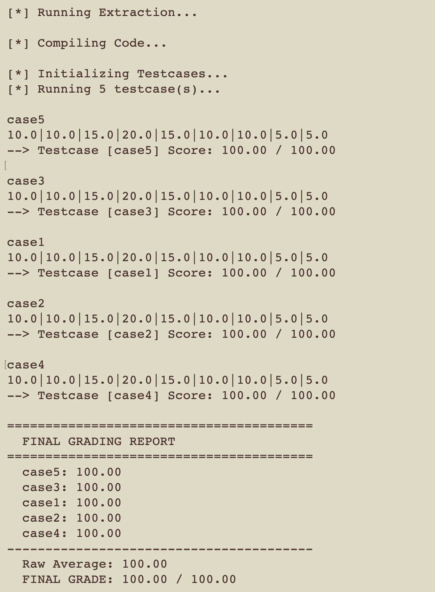

# Hw3 — `mergeext2fs`: a three-way merge of ext2 filesystems

Three ext2 disk images: a `base`, and two branches `A` and `B` that each grew
files, directories, or extra content on top of it. The job is `git merge`, one
layer lower: fold both branches back into `base` by editing the image itself —
inodes, bitmaps, directory entries, indirect blocks, group descriptors — with
nothing but `open`/`read`/`write`/`lseek`. No `mount`, no libext2fs, no kernel
help.

```bash
make
./mergeext2fs base.img A.img B.img
```

It runs in two parts.

**Part 1 — say what will happen (read-only).** Print `base`'s directory tree,
then print the *merged* tree with a tag on every entry that the merge would
touch:

```
- root/
-- a.txt:MOD:A            only A changed it
-- b.txt:MOD:AB           both branches appended to it
-- notes/:NEW:A           A created the directory
--- new.txt:NEW:B         B created the file
```

Tagging is deliberately mtime-based rather than content-based: an entry missing
from `base` is `:NEW:`, and an entry whose modification time moved away from
`base`'s is `:MOD:`, per branch.

**Part 2 — actually do it (in place).** Walk the three trees together and, for
every name in the union of their directory entries, decide: copy it in, append to
it, or leave it alone. New files and directories get a freshly allocated inode
and blocks; modified files get the bytes each branch added after the common
prefix, in a deterministic order when both branches appended. Then fix up
everything the kernel would normally maintain for you.

## The parts that were actually hard

**Allocation is manual, and it has to stay consistent.** `allocate_inode()` and
`allocate_block()` scan the per-group bitmaps for a free bit, set it, and then
decrement `free_blocks_count` / `free_inodes_count` in *both* the block group
descriptor and the superblock — and bump `used_dirs_count` when the new inode is
a directory. Get any one of those wrong and `e2fsck` screams even though the
files look fine.

**Indirect blocks.** `get_file_block_at()` / `set_file_block_at()` translate a
logical file block index into a physical one across the direct, single-indirect,
double-indirect and triple-indirect paths, allocating and zeroing the pointer
blocks on the way down when a write lands somewhere that has no chain yet.
`i_blocks` is counted in 512-byte sectors and must include those pointer blocks,
not just the data — `count_physical_blocks()` recounts it from the chain rather
than trying to keep a running total.

**Directory entries are a packed slack-list.** `add_dir_entry()` finds a record
whose `rec_len` has enough spare room, splits it in place, and appends the new
entry — plus `write_dot_entries()` for `.` and `..`, and the parent's
`links_count` when a subdirectory appears.

**Superblock and GDT backups.** `write_backups()` rewrites the redundant copies
in the later block groups, skipping group 0 (that's the primary, and for
`block_size > 1024` it overlaps the boot area) and skipping groups that carry no
backup at all.

**Durability.** The grader copies the image out from under you, so `main()` ends
with an explicit `fsync()` before closing.

## Result



All five official test cases, every rubric line, 100/100.

## Layout

```
hw3.cpp                     the whole implementation (~1.3k lines)
ext2fs.h                    on-disk structs (course-provided)
ext2fs_print.c/.h           output helpers (course-provided)
Makefile                    -> ./mergeext2fs
hw3_grader.py  tree.py      course-provided checker
hw3-writeup.pdf             the assignment
notes/GUIDE.md              my walkthrough of the code, section by section (TR)
notes/DEEP-DIVE.md          ext2 layout and algorithm notes, with diagrams (TR)
```

The `.img` test fixtures aren't in the repo — they're 10 MB each, 663 MB in
total. `hw3_grader.py` builds and scores against your own copies.
